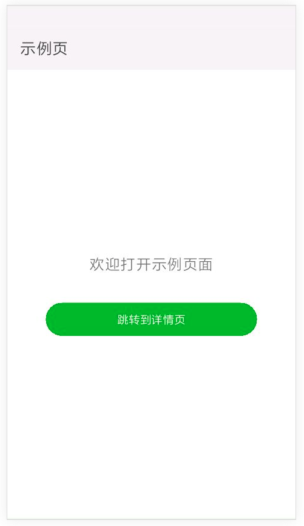

## 使用Vue开发快应用

*在1053版本，可以使用Vue进行开发快应用，低于1053的快应用版本暂不支持*

### 安装hap-toolkit

全局或本地安装`hap-toolkit@0.6.1`，命令行执行以下命令

> npx hap --version

保证版本号大于 0.6.1

新建快应用项目`quickapp-vue`

> npx hap init quickapp-vue --dsl=vue

进入到`quickapp-vue`目录，执行`npm i -d`安装依赖包。安装完成后执行可以开启两个终端执行

> npx hap server

> npx hap build --include-dsl-from-lib

或者使用以下命令进行watch

> npx hap server --watch --include-dsl-from-lib

打开调试器可以看到以下结果



页面跳转也是正常的。

#### 使用async/await
有的开发者习惯使用async/await语法糖，但是在现在的项目中使用报错，怎么办呢？

这个时候配置一下`babel.config.js`

```json
  // plugins: ['@babel/plugin-transform-modules-commonjs']
  
  // 修改上面这一行，如下
  
  // plugins: ['@babel/plugin-transform-modules-commonjs', '@babel/plugin-transform-runtime'],

  // 添加一行，如下
  // ignore: [/[/\\]core-js/, /@babel[/\\]runtime/],

```
命令行执行
> npm i -d @babel/plugin-transform-runtime

命令行再次执行
> npx hap server --watch --include-dsl-from-lib

使用`async/await`正常

#### 使用插件和less

有的开发者希望引入less预编译css。

`hap-toolkit`目前支持自定义`loader`和`plugin`配置，这里演示如何让Vue项目支持less。
在`quickapp-vue`的根目录新增文件`hap.config.js`

```javascript

const MiniCssExtractPlugin = require('mini-css-extract-plugin')
const VueLoaderPlugin = require('vue-loader/lib/plugin')

module.exports = {
  module: {
    rules: [
      {
      test: /\.css$/,
      use: [MiniCssExtractPlugin.loader, 'css-loader']
    }, 
    {
      test: /\.less$/,
      use: [MiniCssExtractPlugin.loader, 'css-loader', 'less-loader']
    }, {
      test: /\.vue$/,
      use: [{
        loader: 'vue-loader',
        options: {
          hotReload: false // 关闭热重载
        }
      }]
    }]
  },
  plugins: [
    new VueLoaderPlugin(),
    new MiniCssExtractPlugin({
      filename: '[name].css.json',
    })
  ]
}

```
由于添加了依赖，所以需要安装。命令行执行

> npm i -D less-loader less

命令行再次执行
> npx hap server --watch --include-dsl-from-lib

在单文件`index.vue`内的style标签使用`lang="less"`正常运行

*注意，目前的hap.config.js只支持loader和plugin，语法同webpack*

#### 打包

打测试包，执行以下命令

> npx hap build --include-dsl-from-lib

*注意，这里必须添加include-dsl-from-lib选项，由于快应用内暂时支持vue-dsl，需要通过该选项引入vue的dsl文件*

打正式包，添加正式的私钥文件，执行以下命令

> npx hap release --include-dsl-from-lib